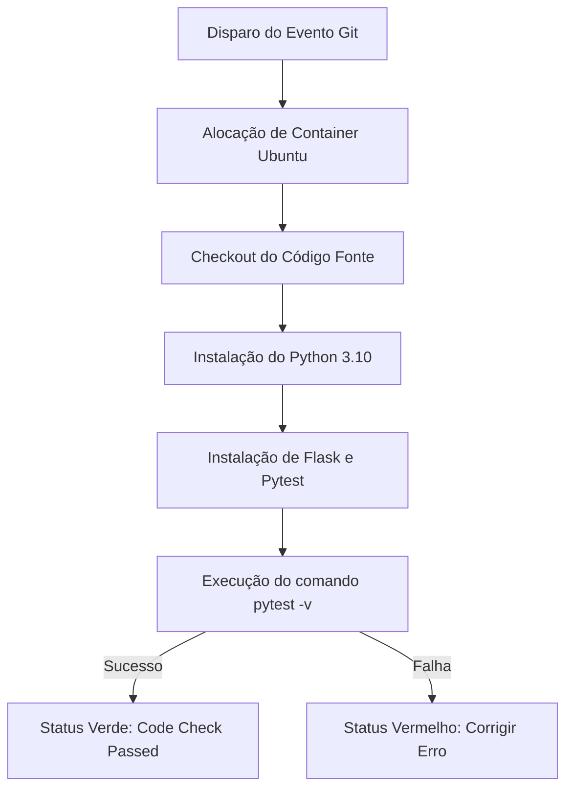

# TaskFlow Ágil: Gerenciador de Tarefas Kanban

Este projeto é um sistema web completo e didático para gerenciamento de tarefas utilizando a metodologia ágil Kanban. Ele foi desenvolvido como trabalho prático para a disciplina de **Engenharia de Software**, demonstrando boas práticas de desenvolvimento de software, padrões de arquitetura de software (MVC simplificado), automação de testes unitários e integração contínua (CI).

---

## 1. Objetivo do Projeto

O objetivo deste projeto é fornecer uma aplicação web simples, limpa e funcional que auxilie equipes acadêmicas ou profissionais a gerenciarem suas demandas diárias por meio de um quadro visual ágil. O projeto demonstra na prática conceitos como:
*   Persistência de dados local sem dependências de infraestrutura complexa (SQLite).
*   Separação clara de responsabilidades (Rotas vs. Modelos de Negócio).
*   Testabilidade de software (testes unitários e de integração com Pytest).
*   Integração Contínua (GitHub Actions).
*   Metodologia ágil visual (Quadro Kanban).

---

## 2. Escopo do Sistema

O sistema é centrado no ciclo de vida de uma **Tarefa** (Task) em um fluxo ágil simples. O escopo compreende:
*   **Quadro Kanban Interativo:** Exibição das tarefas distribuídas nas colunas: **A Fazer**, **Em Progresso** e **Concluído**.
*   **CRUD Completo:**
    *   **Criar (Create):** Adicionar novas tarefas com título, descrição, prioridade e coluna inicial.
    *   **Ler (Read):** Listagem automática de todas as tarefas de forma organizada e reativa na tela principal.
    *   **Atualizar (Update):** Tela de edição de detalhes da tarefa ou botões de atalho rápido para mover o status entre as colunas do quadro.
    *   **Excluir (Delete):** Remoção física e permanente da tarefa com solicitação segura de confirmação do usuário.
*   **Sistema de Alertas (Flash Messages):** Notificações amigáveis a cada ação realizada pelo usuário (ex: sucesso ao mover, erro ao tentar cadastrar sem título).

---

## 3. Mudança de Escopo (Refinamento Ágil)

> [!IMPORTANT]
> **Explicação da Mudança de Escopo:**
> Durante as reuniões de refinamento (*Backlog Refinement*) realizadas na metade do ciclo de desenvolvimento do projeto, a equipe identificou uma falha no planejamento inicial: no quadro Kanban simples, os desenvolvedores tinham dificuldades em saber **qual tarefa puxar primeiro** quando a coluna *A Fazer* acumulava muitas demandas.
> 
> Para solucionar este gargalo e otimizar o fluxo de entrega, a equipe aprovou a **adição da funcionalidade de Prioridade das Tarefas** (Alta, Média, Baixa) como um novo requisito. A implementação foi realizada com sucesso:
> 1. Na camada de dados (SQLite), adicionou-se a coluna `priority` com restrição de valores.
> 2. Na interface visual (HTML/CSS), foram desenhadas *Badges* coloridas reativas (Vermelho para Alta, Laranja para Média, Azul para Baixa), facilitando a identificação imediata das urgências.

---

## 4. Tecnologias Utilizadas

A pilha tecnológica foi criteriosamente escolhida para garantir simplicidade de execução local, sem a necessidade de instalar servidores robustos de banco de dados:

*   **Linguagem:** Python 3.10+
*   **Framework Web:** Flask (Leve, flexível e ideal para fins acadêmicos)
*   **Banco de Dados:** SQLite (Armazenamento em arquivo local, nativo do ecossistema Python)
*   **Estilização:** CSS3 Puro (Tema escuro premium, responsivo, com variáveis de design de ponta e transições dinâmicas)
*   **Automação de Testes:** Pytest (Suíte moderna de testes funcionais e de integração)
*   **Integração Contínua (CI):** GitHub Actions (Pipeline para execução de testes automatizados na nuvem)

---

## 5. Estrutura do Projeto

A organização dos arquivos segue o padrão recomendado para desenvolvimento modular em Python/Flask:

```text
gerenciador_tarefas_agil/
├── .github/
│   └── workflows/
│       └── ci.yml               # Workflow de testes automatizados (GitHub Actions)
├── docs/
│   ├── diagrams.md              # Diagramas de Casos de Uso e Classes em formato Mermaid
│   └── kanban_documentation.md  # Conceito de Kanban, sugestão de Cards e lista de Commits
├── src/
│   ├── __init__.py              # Arquivo de inicialização do pacote
│   ├── app.py                   # Arquivo controlador (Rotas, Views e controle de fluxo do Flask)
│   ├── database.py              # Gerenciador de conexão SQLite e migração de tabelas
│   └── models.py                # Modelo Task com lógica de validação de dados e queries CRUD
├── static/
│   └── css/
│       └── style.css            # Folha de estilos CSS3 com design moderno escuro
├── templates/
│   ├── base.html                # Esqueleto HTML comum e tratamento de flash messages
│   ├── index.html               # Tela principal do Kanban (formulário de inserção e colunas)
│   └── edit.html                # Tela dedicada de formulário para edição de tarefas
├── tests/
│   ├── conftest.py              # Fixture do Pytest para isolar banco de dados em tempo de teste
│   └── test_app.py              # Arquivo contendo a suíte de testes de rotas e modelos
├── requirements.txt             # Dependências externas do Python a serem instaladas
├── .gitignore                   # Arquivos ignorados no repositório (ex: banco tasks.db local)
└── README.md                    # Documentação principal para entrega acadêmica
```

---

## 6. Como Executar o Projeto Localmente

Siga o passo a passo para colocar a aplicação em execução no seu computador:

### Passo 1: Clonar ou Baixar o Projeto
Certifique-se de estar com o terminal aberto na pasta raiz do projeto.

### Passo 2: Criar e Ativar o Ambiente Virtual (Opcional, mas Recomendado)
No terminal do Windows (PowerShell):
```powershell
python -m venv venv
.\venv\Scripts\Activate.ps1
```

### Passo 3: Instalar as Dependências
Instale o Flask e Pytest listados no arquivo de requisitos:
```bash
pip install -r requirements.txt
```

### Passo 4: Executar a Aplicação Flask
Execute o comando abaixo para iniciar o servidor de desenvolvimento local:
```bash
python src/app.py
```
Acesse no seu navegador de internet o seguinte endereço:
 **[http://127.0.0.1:5000](http://127.0.0.1:5000)**

*(O arquivo de banco de dados `tasks.db` será gerado automaticamente na raiz do projeto na primeira execução)*

---

##  7. Como Executar os Testes Automatizados

Os testes automatizados cobrem a integridade dos dados, regras de validação (como impedimento de campos vazios) e o retorno HTTP correto de cada rota web.

Para executar a suíte inteira de testes usando o Pytest, certifique-se de que as dependências do `requirements.txt` estão instaladas e rode no terminal:
```bash
pytest -v
```

> [!TIP]
> **Isolamento de Banco:** 
> Durante os testes, o Pytest utiliza uma fixture especial que redireciona temporariamente a escrita de banco para arquivos voláteis na pasta temporária do sistema operacional (`tmp_path`). Isso garante que os seus testes de inserção e exclusão nunca sujem ou apaguem dados do seu arquivo `tasks.db` de desenvolvimento local!

---

##  8. Integração Contínua com GitHub Actions

O projeto conta com o pipeline **GitHub Actions** configurado para automação da qualidade de código. 

### Como funciona:
No arquivo [ci.yml](file:///.github/workflows/ci.yml), está configurado um workflow que é disparado de forma totalmente automática pelo GitHub sempre que:
1. Um desenvolvedor realiza um `git push` para o repositório principal nos branches `main` ou `master`.
2. Um `Pull Request` é aberto contra os mesmos branches.

### Etapas do Pipeline:

Se todos os testes passarem, o repositório exibe o selo verde de aprovação . Caso ocorra alguma falha, a equipe é notificada imediatamente para corrigir o bug antes de realizar o merge.

Atualização realizada para melhoria da documentação do sistema.