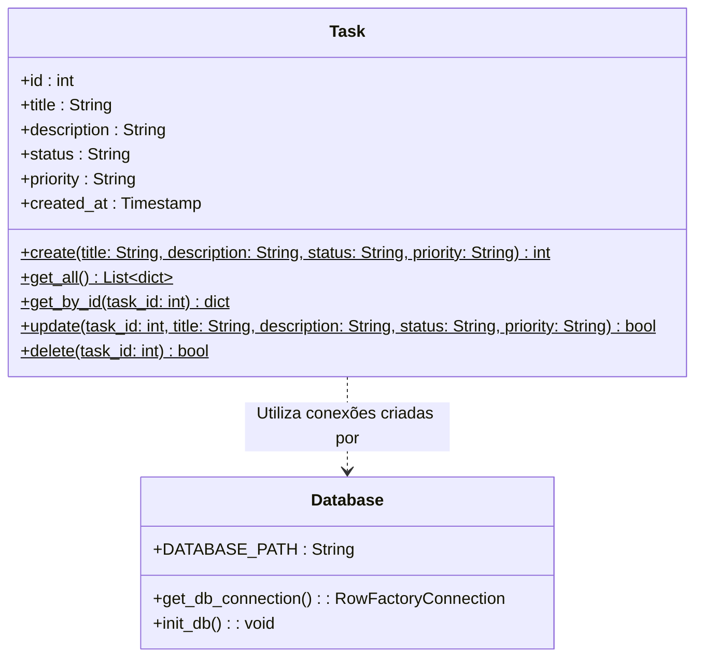

# Diagramas do Sistema - Engenharia de Software

Este documento contém os diagramas UML desenvolvidos para documentar a arquitetura e os requisitos funcionais do sistema **TaskFlow Ágil**, facilitando a entrega e apresentação do trabalho acadêmico.

Os diagramas utilizam a sintaxe **Mermaid** e podem ser renderizados diretamente no GitHub, VS Code ou outros visualizadores compatíveis.

---

## 1. Diagrama de Casos de Uso (UML)

Este diagrama representa os limites do sistema, os atores envolvidos e as principais funcionalidades oferecidas pela aplicação.

```mermaid
usecaseDiagram
    actor "Membro da Equipe" as user

    rect "Sistema TaskFlow Ágil (Fronteira)" {
        usecase "UC01 - Criar Tarefa" as UC_Criar
        usecase "UC02 - Listar Tarefas no Kanban" as UC_Listar
        usecase "UC03 - Editar Tarefa" as UC_Editar
        usecase "UC04 - Excluir Tarefa" as UC_Excluir
        usecase "UC05 - Mover Coluna (Atualizar Status)" as UC_Mover
        usecase "UC06 - Definir Prioridade da Tarefa" as UC_Prioridade
    }

    user --> UC_Criar
    user --> UC_Listar
    user --> UC_Editar
    user --> UC_Excluir
    user --> UC_Mover
    user --> UC_Prioridade
```

### Detalhes das Ações (Atores e Casos de Uso):
- **Membro da Equipe:** O ator principal responsável por interagir com o quadro Kanban para progredir no fluxo de trabalho.
- **Mudança de Escopo (UC06):** Inserida de forma integrada a **UC01** e **UC03**, permitindo classificar tarefas pela urgência (Alta, Média, Baixa) e orientar a priorização das tarefas na coluna *A Fazer*.

---

## 2. Diagrama de Classes (UML)

O diagrama abaixo ilustra a arquitetura estrutural do sistema, focando nas responsabilidades da classe `Task` (camada de Model) e sua relação com o helper de banco de dados SQLite (`database`).



### Detalhamento dos Componentes:
- **Classe Database:** Módulo estático (`database.py`) responsável por gerenciar a conectividade física com o arquivo SQLite e automatizar a migração inicial da tabela.
- **Classe Task:** Entidade principal do domínio da aplicação (`models.py`) encapsulando os métodos de persistência direta (`Active Record` simplificado) e regras de validação associadas (por exemplo, bloqueio de títulos em branco).
